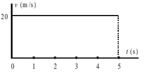
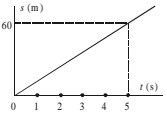
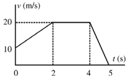
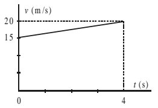
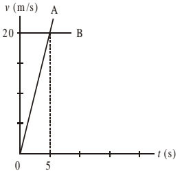
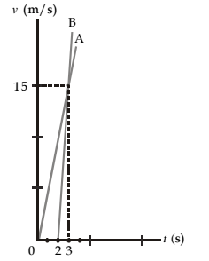

# Soal Gerak

---
---

## Bagian A

---

1. Sebuah mobil bergerak ke arah timur sejauh 80 km,
kemudian berbalik arah sejauh 20 km ke arah barat.
Jarak yang ditempuh mobil adalah ....
    - 20 km
    - 60 km
    - 80 km
    - 100 km
    - 120 km

---

2. Sebuah pesawat bergerak ke arah timur sejauh
80 km, kemudian berbalik arah sejauh 20 km ke
arah barat. Perpindahan yang ditempuh pesawat
adalah ....
    - 20 km
    - 60 km
    - 80 km
    - 100 km
    - 120 km

---

3. Seseorang berjalan sejauh 60 m ke timur dalam
waktu 60 s, kemudian 20 m ke barat dalam waktu
40 s. Laju rata-rata dan kecepatan rata-rata orang
tersebut adalah ....
    - 0,2 m/s dan 0,8 m/s ke timur
    - 0,8 m/s dan 0,2 m/s ke barat
    - 0,3 m s dan 0,4 m/s ke timur
    - 0,8 m/s dan 0,4 m/s ke timur
    - 0,4 m/s dan 0,8 m/s ke barat

---

4. Sebuah mobil bergerak dengan persamaan sebagai
berikut, s = 2t3 + 5t2 + 5, s dalam meter, t dalam sekon.
Kecepatan rata-rata dalam selang waktu antara 2 s
dan 3 s adalah ....
    - 12 m/s
    - 27 m/s
    - 31 m/s
    - 54 m/s
    - 63 m/s

---

5. Mobil bergerak dengan kecepatan awal 5 m/s. Setelah
5 sekon, kecepatannya berubah menjadi 20 m/s maka
percepatan benda adalah ....
    - 1 m/s2
    - 2 m/s2
    - 3 m/s2
    - 4 m/s2
    - 5 m/s2

---

6. Mobil bergerak diperlambat dengan kecepatan ber-
ubah dari 25 m/s menjadi 5 m/s selama 4 sekon
maka perlambatannya adalah ....
    - 2 m/s2
    - –7,5 m/s2
    - 5 m/s2
    - –5 m/s2
    - 7,5 m/s2

---

7. Sebuah benda bergerak lurus beraturan dalam waktu
10 sekon dan menempuh jarak 80 meter, kecepatan
benda tersebut adalah ....
    - 4 m/s
    - 6 m/s
    - 8 m/s
    - 10 m/s
    - 12 m/s

---

8. Grafik suatu benda bergerak lurus beraturan tampak
seperti gambar berikut ini.\
  \
Jarak yang di tempuh selama selama 4 sekon adalah ....
    - 20 m
    - 40 m
    - 60 m
    - 80 m
    - 100 m

---

9. Perhatikan grafik berikut ini. \
\
Besar kecepatan benda adalah ....
    - 5 m/s
    - 12 m/s
    - 15 m/s
    - 20 m/s
    - 25 m/s

---

10. Sebuah mobil yang mula-mula diam, kemudian ber-
gerak. Setelah 80 km, kecepatannya berubah menjadi
40 km/jam. Waktu yang diperlukan untuk me-
nempuh jarak tersebut adalah ....
    - 4 jam
    - 8 jam
    - 12 jam
    - 15 jam
    - 20 jam

---

11. Dua buah mobil A dan B bergerak saling mendekati
dengan kecepatan masing-masing 36 km/jam dan
72 km/jam. Jika jarak kedua mobil 900 m, kedua
mobil akan berpapasan setelah ....
    - 10 sekon
    - 20 sekon
    - 30 sekon
    - 60 sekon
    - 90 sekon

---

12. Perhatikan grafik berikut. \
 \
Dari grafik tersebut, jarak yang ditempuh selama 5 s
adalah ....
    - 60 m
    - 70 m
    - 80 m
    - 90 m
    - 100 m

---

13. Sebuah pesawat terbang memerlukan waktu 20 s
dan jarak 400 m untuk lepas landas. Kecepatan
pesawat tersebut ketika lepas landas adalah ....
    - 10 m/s
    - 20 m/s
    - 30 m/s
    - 40 m/s
    - 50 m/s

---

14. Sebuah mobil bergerak dengan kecepatan awal
10 m/s dan mengalami perlambatan 2 m/s2. Dalam
5 sekon, mobil tersebut menempuh jarak sejauh ....
    - 5 m
    - 10 m
    - 15 m
    - 20 m
    - 25 m

---

15. Benda bergerak seperti dinyatakan dalam grafik
berikut. \
 \
Jarak yang ditempuh selama 4 sekon adalah ....
    - 35 m  
    - 50 m
    - 60 m
    - 70 m
    - 80 m

---

16. Waktu yang diperlukan sebuah mobil yang ber-
gerak dengan percepatan 2 m/s2, untuk me-
ngubah kecepatannya dari 10 m/s menjadi 30 m/s
adalah ....
    - 10 s  
    - 20 s  
    - 30 s
    - 40 s
    - 50 s

---

17. Dua benda bergerak seperti grafik berikut. \
 \
Kedua benda tersebut akan bertemu setelah ....
    - 5 sekon
    - 8 sekon
    - 10 sekon
    - 12 sekon
    - 16 sekon

---

18. Perhatikan grafik berikut.  \
 \
Dari grafik tersebut, percepatan A dan B adalah ....
    - 3 m/s2 dan 5 m/s2
    - 3 m/s2 dan 15 m/s2
    - 5 m/s2 dan 3 m/s2
    - 15 m/s2 dan 5 m/s2
    - 5 m/s2 dan 15 m/s2

---

19. Sebuah benda jatuh bebas dari ketinggian 45 m, waktu yang dibutuhkan saat menyentuh tanah adalah ....
    - 2 sekon  
    - 3 sekon  
    - 5 sekon
    - 7 sekon
    - 9 sekon

---

20. Bola tenis jatuh dari ketinggian 5 m. Kecepatan benda
saat menyentuh tanah adalah ... (g = 10 m/s2).
    - 5 m/s  
    - 10 m/s  
    - 20 m/s
    - 50 m/s
    - 100 m/s

---

21. Sebuah benda dilempar ke atas dengan kecepatan
awal 20 m/s. Waktu yang dibutuhkan untuk kembali
ke tanah adalah ....
    - 1 sekon  
    - 2 sekon  
    - 3 sekon
    - 4 sekon
    - 5 sekon

---

22. Sebuah benda dilemparkan ke bawah dengan
kecepatan awal V0. Jarak dari posisi lempar supaya
kecepatan benda menjadi 2 kali semula adalah ....
    - 
    - 
    - 
    - 
    - 

---

23. Sebuah batu dilepaskan dari menara dan tiba di
tanah dalam waktu 5 sekon. Ketinggian menara
adalah ....
    - 25 m
    - 50 m  
    - 75 m
    - 100 m
    - 125 m

---

24. Terdapat dua buah batu yang akan dilempar. Batu
pertama dilemparkan ke atas dari permukaan tanah
dengan kecepatan awal 60 m/s. Batu kedua
dilemparkan ke bawah dari sebuah gedung dengan
kecepatan awal 40 m/s. Jika jarak kedua batu 400 m,
kedua batu tersebut akan bertemu setelah bergerak
selama ....
    - 2 sekon  
    - 3 sekon  
    - 4 sekon
    - 6 sekon
    - 10 sekon

---

25. Terdapat dua buah bola yang berjarak 100 m. Bola
pertama bergerak jatuh bebas dan pada saat ber-
samaan bola kedua dilemparkan ke atas dengan
kecepatan awal 40 m/s. Jarak kedua bola setelah
2 sekon adalah ....
    - 10 m
    - 20 m
    - 40 m
    - 60 m
    - 80 m
 

---
---

## Bagian B

---

1. Sebuah mobil sedang bergerak dengan kecepatan
36 km/jam, tentukanlah: \
&nbsp; a. waktu yang diperlukan untuk menempuh jarak 10 km, \
&nbsp; b. jarak yang ditempuh selama 10 menit.

---

2. Sebuah benda bergerak sepanjang sumbu-x. Setelah
bergerak selama 2 sekon, benda berada pada posisi
x1 = 16 m dan setelah 5 sekon benda berada pada
posisi x2 = 10 m. Tentukanlah jarak, perpindahan,
laju, dan kecepatan rata- rata pada waktu tersebut!

---

3. Mobil A bergerak dengan laju 72 km/jam dan
berada 200 m di belakang mobil B yang sedang ber-
gerak dengan kelajuan 54 km/jam. Kapan mobil
A menyusul mobil B?

---

4. Sebuah benda mula-mula diam, kemudian bergerak.
Setelah 10 sekon, kecepatan benda menjadi 15 m/s2.
Hitung percepatan benda tersebut.

---

5. Mobil yang sedang bergerak dengan kecepatan
72 km/jam, pada jarak 100 m tiba-tiba mengalami
perlambatan 3 m/s2 karena tepat di depan mobil tersebut
ada seorang nenek yang sedang melintas. Apakah
mobil tersebut akan menabrak nenek yang sedang
melintas di jalan?

---

6. Sebuah kelapa jatuh bebas dari ketinggian 20 m.
Berapakah waktu dan kecepatan saat tiba di tanah?

---

7. Dua buah benda terpisah sejauh 100 m dalam arah
vertikal. Benda pertama mula-mula di tanah,
kemudian ditembakkan dengan kecepatan awal
20 m/s ke atas. Pada saat yang bersamaan, benda
kedua jatuh bebas. Kapan dan di mana kedua benda
berpapasan?

---

8. Sebuah benda dilemparkan ke atas dan mencapai
ketinggian maksimum 40 m. Hitunglah: \
&nbsp;a. kecepatan awal benda, \
&nbsp;b. waktu untuk mencapai tinggi maksimum, \
&nbsp;c. kecepatan setelah 3 sekon, dan \
&nbsp;d. ketinggian setelah 3 sekon.

---

9. Dari puncak menara setinggi 60 m, sebuah benda
dilemparkan ke atas dengan kecepatan 10 m/s.
Hitunglah kecepatan dan waktu benda ketika tiba
di tanah.

---

10. Sebuah benda dilemparkan ke atas dengan
kecepatan awal $v_0$ dari permukaan Bumi. Jika benda
dibawa ke Bulan dan dilemparkan ke atas dengan
kecepatan awal $2v_0$. Tentukanlah perbandingan
tinggi maksimum di Bumi dan di Bulan.
(Petunjuk: $g_{Bulan} = \frac{1}{6}g_{Bumi}$

---

 
 
 

>**Ilmu Tidaklah diperoleh, melainkan dengan**
>
>
>**SIkap Tawadlu' dan Serius**
